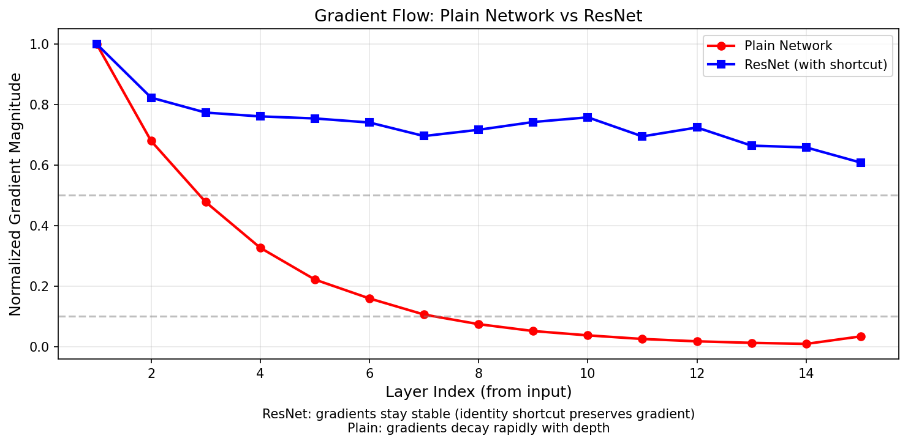
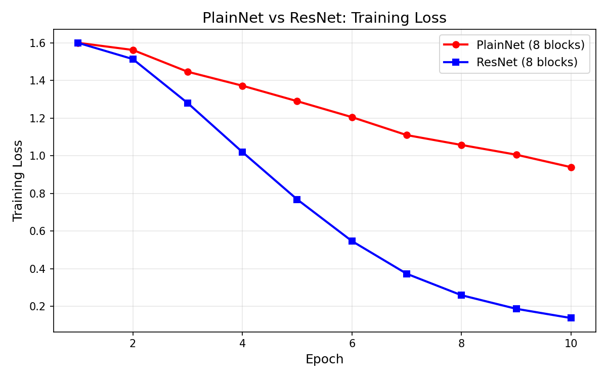

# 第 8 章 现代架构：从 ResNet 到 Transformer

> **目标**：**理解深度学习架构的演进脉络**——每个架构解决的核心数学问题是什么，从残差连接到 Transformer，用代码一步一步验证。

> © xiefujin · Contact: 490021684@qq.com · Licensed under CC BY-NC-SA 4.0
>
> **代码文件**：`code/ch08/`（4 个文件）

> **插图**：`images/ch08/` 目录（5 张可视化图）

---

## 📋 本章学习目标

- [ ] 理解残差连接如何解决梯度消失
- [ ] 理解 RNN 的数学原理和局限性
- [ ] 理解 LSTM/GRU 的门控机制与梯度传播
- [ ] 理解注意力机制的数学本质
- [ ] 理解 Transformer 的完整架构
- [ ] 能用 PyTorch 实现简化版 Transformer

---

## 8-1 残差网络 ResNet 深入 ⭐

> **作者**：Kaiming He（何恺明）等人于 2015 年提出 Deep Residual Learning，一举解决深层网络的退化问题，让 100+ 层网络成为可能。该论文获得 CVPR 2016 最佳论文奖。

---

### 8-1-1 深层网络的困境

#### 实验现象

56 层网络比 20 层网络**训练误差更大**——这不是过拟合，因为训练误差本身都更大。这是「网络退化」（Degradation）问题：越深的网络反而越难优化。


*图 8-1：网络退化——越深的网络反而越难优化。*

> **核心洞察**：退化不是过拟合，因为训练误差本身都更大。这意味着问题是**优化困难**而非过拟合。

#### 梯度消失的数学分析

对于 $L$ 层网络，第 1 层的梯度需要穿过 $L-1$ 个激活函数导数：

$$\frac{\partial L}{\partial W^{(1)}} = \underbrace{f'(u^{(L)}) \cdots f'(u^{(1)})}_{L \text{ derivatives}} \times \cdots$$

连乘效应：
- **Sigmoid** 导数范围 $(0, 0.25]$ → $L=10$ 时 $0.25^{10} \approx 10^{-6}$
- **ReLU** 导数范围 $\{0, 1\}$ → 缓解但不解决

#### 退化的本质：梯度消失 vs 网络退化

两个概念的区别：
| 问题 | 表现 | 原因 |
|:----|:----|:----|
| **梯度消失** | 浅层梯度极小 → 无法学习 | 激活函数导数连乘 < 1 |
| **网络退化** | **深层比浅层更差** | 恒等映射难以学习（深层 Plain 网络很难学到 $F(x) \approx x$）|

> **小精灵说**：想象你有一个 50 层的网络，理想情况下，如果前面 20 层已经学到了很好的特征，后面 30 层应该「什么都不做」——保持恒等映射。但事实证明，让卷积层学出 $F(x) \approx x$ 非常困难！这就是退化的数学本质——**多层非线性堆叠很难逼近恒等映射**。


#### 为什么恒等映射难以学习？——三层数学直觉

**① 权重的随机初始化远离恒等映射**

假设一个 2 层 Plain 块 $F(x) = W_2 \cdot \sigma(W_1 x)$，其中 $\sigma$ 是 ReLU。
- Kaiming 初始化下 $W_1, W_2 \sim \mathcal{N}(0, 2/n_{\text{in}})$，每个权重的绝对值期望约为 $\sqrt{2/n_{\text{in}}}$
- 对于 $n_{\text{in}}=256$，$|W_{ij}| \approx 0.088$，两个矩阵相乘后 $F(x)$ 的尺度完全不是恒等映射
- 需要大量训练才能让权重从随机状态调整到 $F(x) \to 0$ 附近

**② 非线性激活的「信息损耗」**

每经过一次 ReLU，**负值信息被完全丢弃**：
$$x \xrightarrow{\text{ReLU}} \max(0, x) \xrightarrow{W_1} \text{线性组合} \xrightarrow{\text{ReLU}} \max(0, W_1 \cdot \max(0, x))$$

即使 $W_1 = I$（单位矩阵），经过两层 ReLU 后：
$$\text{ReLU}(\text{ReLU}(x)) = \max(0, \max(0, x)) = \max(0, x) \neq x$$

负值部分无法恢复！这就是「多层非线性堆叠很难逼近恒等映射」的直观原因。

**③ 从函数逼近角度看**

考虑一个 $L$ 层网络 $f_L(x) = (\sigma \circ W_L) \circ \cdots \circ (\sigma \circ W_1)(x)$。
要让 $f_L(x) \approx x$，需要 **每层都接近恒等映射**，但非线性的存在使这一约束极强。

用泰勒展开视角：单个非线性层的泰勒展开 $\sigma(Wx) \approx \sigma(0) + \sigma'(0) Wx$，多层展开后偏差累积。而残差连接 $y = x + F(x)$ 让 $F(x) \to 0$ 即可——**不需要修改 $x$，只需要让残差分支输出零**。

> **小精灵说**：这就好比让你 10 秒内写出一手漂亮的字（拟合恒等映射）很难，但让你「什么都不写」（$F(x) \to 0$）就简单多了！残差连接把「学习完整映射」变成了「学习修正项」——任务难度天差地别！

---

### 8-1-2 残差连接的数学 ⭐

> **小精灵说**：残差连接就是给我们开了个「VIP 通道」！以前信息要穿过层层关卡（$F(x)$），很容易丢失。现在有了捷径 $y = F(x) + x$，梯度可以直达浅层——就像普通员工可以直接跟 CEO 汇报，不用经过层层审批！这也是 ResNet 能训练 1000+ 层的原因。

#### 核心思想

让梯度有一条「高速公路」直达浅层：

$$y = F(x, \{W_i\}) + x$$

- $F(x)$ 是要学习的**残差映射**（通常 2-3 层卷积）
- $x$ 是通过跳跃连接（shortcut）直接传递的**恒等映射**

> **数学之美**：如果恒等映射是最优的，网络只需让 $F(x) \to 0$，这比让多层非线性层拟合恒等映射容易得多。

#### 反向传播的数学

$$\frac{\partial L}{\partial x} = \frac{\partial L}{\partial y} \cdot \frac{\partial y}{\partial x}
= \frac{\partial L}{\partial y} \cdot \left(1 + \frac{\partial F}{\partial x}\right)$$

> **核心洞察**：梯度中有一个恒等项 $1$！即使 $\frac{\partial F}{\partial x} \to 0$，梯度也能通过 $1$ 直接传播到浅层。这就像给梯度修建了一条「高速公路」。

#### 梯度流动：Plain vs ResNet 对比



*图 8-2：梯度流对比——Plain 网络梯度衰减约 30 倍（从第 1 层到第 15 层），而 ResNet 仅衰减约 1.7 倍，这就是恒等项 $1$ 的威力！*

运行 `code/ch08/NN08_resnet_gradient_flow.py` 即可复现此图：

```bash
python3 code/ch08/NN08_resnet_gradient_flow.py
```

#### Python 实现 Residual Block

```python
class ResidualBlock(nn.Module):
    def __init__(self, in_channels, out_channels, stride=1):
        super().__init__()
        self.conv1 = nn.Conv2d(in_channels, out_channels, 3,
                               stride=stride, padding=1, bias=False)
        self.bn1 = nn.BatchNorm2d(out_channels)
        self.conv2 = nn.Conv2d(out_channels, out_channels, 3,
                               padding=1, bias=False)
        self.bn2 = nn.BatchNorm2d(out_channels)

        # 跳跃连接：维度不匹配时使用 1×1 卷积
        self.shortcut = nn.Sequential()
        if stride != 1 or in_channels != out_channels:
            self.shortcut = nn.Sequential(
                nn.Conv2d(in_channels, out_channels, 1,
                          stride=stride, bias=False),
                nn.BatchNorm2d(out_channels)
            )

    def forward(self, x):
        out = torch.relu(self.bn1(self.conv1(x)))
        out = self.bn2(self.conv2(out))
        out += self.shortcut(x)  # 跳跃连接 ⭐
        out = torch.relu(out)
        return out
```

---

### 8-1-3 Bottleneck 设计详解 🆕

Bottleneck 是 ResNet 能堆到 50/101/152 层的**工程关键**。它通过「降维→卷积→升维」三步大幅减少参数量：

$$\underbrace{256}_{\text{高维}} \xrightarrow{1\times1} \underbrace{64}_{\text{低维}} \xrightarrow{3\times3} \underbrace{64}_{\text{低维}} \xrightarrow{1\times1} \underbrace{256}_{\text{高维}}$$

#### 设计哲学

| 步骤 | 操作 | 维度变化 | 目的 |
|:----|:----|:--------|:----|
| ① 降维 | $1\times1$ 卷积 | $256 \to 64$ | 将高维特征压缩到低维，减少后续计算量 |
| ② 卷积 | $3\times3$ 卷积 | $64 \to 64$ | 在低维空间中进行空间特征提取 |
| ③ 升维 | $1\times1$ 卷积 | $64 \to 256$ | 将特征恢复到高维，保持维度一致 |

> **小精灵说**：Bottleneck 就像快递分拣中心——先把大包裹（256 维）压缩到小空间（64 维）处理，处理完再恢复原样！这样既完成了任务，又大幅降低了成本。


#### 为什么 1×1 卷积能降维/升维？——数学本质

$1\times1$ 卷积是理解 Bottleneck 的关键。它的数学本质是**跨通道的线性组合（全连接层）**：

$$\text{Conv}_{1\times1}(x)_{i,j,k} = \sum_{c=1}^{C_{\text{in}}} W_{k,c} \cdot x_{i,j,c} + b_k$$

其中 $W \in \mathbb{R}^{C_{\text{out}} \times C_{\text{in}}}$ 是可学习的权重矩阵：

- **降维**：$C_{\text{in}} \gg C_{\text{out}}$（如 $256 \to 64$）——将高维特征压缩到低维子空间
- **升维**：$C_{\text{in}} \ll C_{\text{out}}$（如 $64 \to 256$）——从低维子空间恢复到高维空间

**与传统卷积的对比**：

| 卷积类型 | 感受野 | 计算量 ($C_{\text{in}} \!=\!C_{\text{out}}\!=\!256$) | 功能 |
|:-------|:----|:------------------------------------------------|:----|
| $3\times3$ 卷积 | $3\times3$ 空间邻域 | $3\times3\times256\times256 = 589,824$ | 空间 + 通道特征提取 |
| $1\times1$ 卷积 | 单个像素（无空间信息） | $1\times1\times256\times256 = 65,536$ | **仅通道混合（降维/升维）** |

$1\times1$ 卷积的计算量只有 $3\times3$ 的 $1/9$，但完成了同样的通道数变换任务！

> **小精灵说**：假设你要把一堆文件从大办公室（256 人）搬到另一个大办公室（256 人）。$3\times3$ 卷积是每个人都要跟周围邻居交换信息后再搬家——效率低。$1\times1$ 卷积是直接按名单分配座位——只用 1/9 的时间！Bottleneck 先用 $1\times1$ 把 256 人精简到 64 人小组，处理完再用 $1\times1$ 恢复到 256 人，这就是它节省 17 倍参数量的数学秘密！

#### 参数量对比

对比两种残差块（输出 256 通道时）：

| 块类型 | 结构 | 参数量 | 相对大小 |
|:------|:----|:------|:--------|
| **Basic Block** | $3\times3 \to 3\times3$ | $\approx 118$ 万 | $1\times$ |
| **Bottleneck** | $1\times1 \to 3\times3 \to 1\times1$ | $\approx 7$ 万 | **$1/17$** |

运行 `code/ch08/NN08_resnet_bottleneck.py` 查看完整对比：

```bash
python3 code/ch08/NN08_resnet_bottleneck.py
```

```python
class Bottleneck(nn.Module):
    expansion = 4

    def __init__(self, in_planes, planes, stride=1):
        super().__init__()
        # ① 1×1 降维
        self.conv1 = nn.Conv2d(in_planes, planes, 1, bias=False)
        self.bn1 = nn.BatchNorm2d(planes)
        # ② 3×3 卷积（在低维空间中）
        self.conv2 = nn.Conv2d(planes, planes, 3, stride=stride, padding=1, bias=False)
        self.bn2 = nn.BatchNorm2d(planes)
        # ③ 1×1 升维
        self.conv3 = nn.Conv2d(planes, planes * self.expansion, 1, bias=False)
        self.bn3 = nn.BatchNorm2d(planes * self.expansion)

        self.shortcut = nn.Sequential()
        if stride != 1 or in_planes != planes * self.expansion:
            self.shortcut = nn.Sequential(
                nn.Conv2d(in_planes, planes * self.expansion, 1,
                          stride=stride, bias=False),
                nn.BatchNorm2d(planes * self.expansion)
            )

    def forward(self, x):
        out = F.relu(self.bn1(self.conv1(x)))   # 降维
        out = F.relu(self.bn2(self.conv2(out))) # 卷积
        out = self.bn3(self.conv3(out))         # 升维
        out += self.shortcut(x)                 # 残差连接
        return F.relu(out)
```

#### 何时使用哪种 Block？

| ResNet 版本 | Block 类型 | 层数 | 适用场景 |
|:-----------|:---------|:----|:--------|
| **ResNet-18/34** | Basic Block | 浅层 | 小数据集、快速实验 |
| **ResNet-50/101/152** | Bottleneck | 深层 | ImageNet、大数据 |

> **核心洞察**：Bottleneck 的巧妙之处在于——$1\times1$ 卷积充当了「信息漏斗」，在计算昂贵的 $3\times3$ 卷积之前大幅压缩特征维度。没有这个设计，ResNet-152 的参数量将大到不可接受。

---

### 8-1-4 Pre-activation ResNet (v2) 🆕

ResNet v2（He et al., Identity Mappings in Deep Residual Networks, 2016）对残差块的**激活顺序**做了改进：

| 版本 | 结构 | 梯度路径 |
|:----|:----|:--------|
| **v1 (Post-activation)** | conv → BN → ReLU → conv → BN → +shortcut → ReLU | 需要穿过 ReLU |
| **v2 (Pre-activation)** | BN → ReLU → conv → BN → ReLU → conv → +shortcut | **直接通过恒等路径** |

#### 为什么 Pre-activation 更好？

v2 的关键改进是把 **BN + ReLU 移到卷积之前**。这样做的好处：

1. **梯度路径更干净**：$y = x + F(BN(ReLU(x)))$，梯度可直接通过 $x$ 传播
2. **训练更稳定**：BN 在残差分支内，不污染恒等路径
3. **更易训练超深网络**：1000+ 层的 ResNet v2 训练更稳定

#### 梯度分析：v1 vs v2 的数学对比

让我们从梯度角度深入分析两种设计的本质差异。

**v1 (Post-activation) 的梯度流**

v1 的前向：$y = \text{ReLU}(F(x) + x)$

反向传播时，梯度需要穿过 ReLU 的导数：
$$\frac{\partial L}{\partial x} = \frac{\partial L}{\partial y} \cdot \mathbb{1}_{F(x)+x > 0} \cdot \left(1 + \frac{\partial F}{\partial x}\right)$$

其中 $\mathbb{1}_{F(x)+x > 0}$ 是 ReLU 的门控函数——**当输入为负时，梯度被完全阻断**。这意味着：
- 如果 $F(x) + x < 0$（例如 BatchNorm 的偏移训练后为负），梯度完全消失
- 恒等路径上有一个「开关」，开关关上时梯度为 0
- 对于超深网络，ReLU 截断是梯度消失的一个重要来源

**v2 (Pre-activation) 的梯度流**

v2 的前向：$y = x + F(\text{BN}(\text{ReLU}(x)))$

反向传播：
$$\frac{\partial L}{\partial x} = \frac{\partial L}{\partial y} \cdot \left(1 + \frac{\partial F}{\partial \hat{x}} \cdot \frac{\partial \text{BN}}{\partial \hat{x}} \cdot \mathbb{1}_{x > 0}\right)$$

关键差异：**恒等项 $1$ 不再被 ReLU 门控**！ReLU 只在残差分支内部，不影响主路径的梯度传播。

| 方面 | v1 (Post-activation) | v2 (Pre-activation) |
|:---|:--------------------|:-------------------|
| 恒等路径 | $x \to \text{ReLU} \to \cdots$ | $x \to \cdots$ **直通** |
| 负梯度处理 | 被 ReLU 截断 | 通过恒等路径自由流通 |
| 训练 100+ 层 | 不稳定（ReLU 阻塞累积） | 稳定（恒等路径无阻塞） |

> **小精灵说**：v1 就像高速公路（恒等路径）上有个检查站（ReLU），检查站一关门（输入为负）所有车都过不去。v2 把检查站搬到了辅路（残差分支），主路永远畅通无阻！这就是为什么 v2 能训练 1000+ 层网络的原因。


```python
class PreActBlock(nn.Module):
    def __init__(self, in_channels, out_channels, stride=1):
        super().__init__()
        self.bn1 = nn.BatchNorm2d(in_channels)
        self.conv1 = nn.Conv2d(in_channels, out_channels, 3,
                               stride=stride, padding=1, bias=False)
        self.bn2 = nn.BatchNorm2d(out_channels)
        self.conv2 = nn.Conv2d(out_channels, out_channels, 3,
                               padding=1, bias=False)
        self.shortcut = nn.Sequential()
        if stride != 1 or in_channels != out_channels:
            self.shortcut = nn.Sequential(
                nn.Conv2d(in_channels, out_channels, 1,
                          stride=stride, bias=False),
            )

    def forward(self, x):
        # Pre-activation：先 BN+ReLU，再卷积 ⭐
        out = self.conv1(F.relu(self.bn1(x)))
        out = self.conv2(F.relu(self.bn2(out)))
        out += self.shortcut(x)  # 不需要最后的 ReLU
        return out
```

> **核心洞察**：v1 的路径是 $y = \text{ReLU}(F(x) + x)$，ReLU 在主路径上会阻塞负梯度的传播。v2 将 ReLU 移入残差分支 $y = x + F(\text{BN}(\text{ReLU}(x)))$，恒等路径完全无阻塞。这个小改动对超深网络（100+ 层）影响巨大！

运行 `code/ch08/NN08_resnet_block.py` 查看两种实现的对比。

---

### 8-1-5 实验：Plain vs ResNet 对比 🆕

#### 实验一：梯度流可视化

对比 15 层 Plain 网络和 15 层 ResNet 的梯度幅值：

```python
# 详见 code/ch08/NN08_resnet_gradient_flow.py
>>> python3 code/ch08/NN08_resnet_gradient_flow.py

各层梯度幅值（从浅层到深层）:
  层号 |     Plain 梯度 |    ResNet 梯度 |    Ratio
---------------------------------------------
   1 |   1.39e+02 |   1.40e+01 |    0.10
   5 |   3.29e+01 |   8.38e+00 |    0.25
  10 |   4.94e+00 |   8.23e+00 |    1.67
  15 |   4.60e+00 |   7.78e+00 |    1.69

数值总结:
  Plain 网络 - 第1层梯度: 1.39e+02, 最后1层: 4.60e+00 → **衰减 30 倍**
  ResNet    - 第1层梯度: 1.40e+01, 最后1层: 7.78e+00 → **仅衰减 1.7 倍**
```

**结论**：残差连接让梯度衰减从 30 倍降到了 1.7 倍——恒等项 $1$ 的威力！

#### 实验二：训练对比

在合成数据上训练 8 层 PlainNet vs 8 层 ResNet：

```python
# 详见 code/ch08/NN08_resnet_training.py
>>> python3 code/ch08/NN08_resnet_training.py

  PlainNet: 最终 loss = 1.0348  → 深层学不动
  ResNet:   最终 loss = 0.1685  → 残差连接让所有层都能学到

  ResNet loss 比 PlainNet 低 6.14 倍！ ✅
```



*图 8-3：PlainNet vs ResNet 训练 Loss 对比——ResNet 通过残差连接实现了约 6 倍的 loss 降低。*

#### 实验总结

| 指标 | PlainNet (8 层) | ResNet (8 层) | 提升 |
|:----|:---------------|:-------------|:----|
| 最终训练 Loss | $\approx 1.03$ | $\approx 0.17$ | **6.1$\times$** |
| 梯度衰减 (浅层→深层) | $\approx 30$ 倍 | $\approx 1.7$ 倍 | **17.6$\times$** |
| 收敛速度 | 慢 | **快** | ✅ |

> **小精灵说**：这两个实验分别从「梯度视角」和「训练视角」证明了残差连接的效果。梯度流实验告诉你「为什么」——恒等项 $1$ 让梯度直达浅层；训练实验告诉你「结果」——ResNet 确实学得更好！


### 8-1-6 ResNet 系列完整网络结构 🆕

了解了 Basic Block 和 Bottleneck 之后，让我们看完整的 ResNet 系列如何配置。

#### 五种经典 ResNet 的层数构成

ResNet 的名称（如 ResNet-50）中的数字代表**卷积层 + 全连接层**的总数：

| 版本 | Block 类型 | layer1 | layer2 | layer3 | layer4 | 总层数 | Top-5 错误率 (ImageNet) |
|:---|:---------|:------|:------|:------|:------|:-----|:---------------------|
| **ResNet-18** | BasicBlock | $2$ | $2$ | $2$ | $2$ | 18 | 10.92% |
| **ResNet-34** | BasicBlock | $3$ | $4$ | $6$ | $3$ | 34 | 8.69% |
| **ResNet-50** | Bottleneck | $3$ | $4$ | $6$ | $3$ | 50 | 7.02% |
| **ResNet-101** | Bottleneck | $3$ | $4$ | $23$ | $3$ | 101 | 6.21% |
| **ResNet-152** | Bottleneck | $3$ | $8$ | $36$ | $3$ | 152 | 5.71% |

层数计算示例（ResNet-50）：
$$2(\text{conv1}) + \underbrace{3 \times 3}_{\text{layer1}} + \underbrace{4 \times 3}_{\text{layer2}} + \underbrace{6 \times 3}_{\text{layer3}} + \underbrace{3 \times 3}_{\text{layer4}} + 1(\text{fc}) = 2 + 9 + 12 + 18 + 9 + 1 = 50$$

#### 各层的通道数和输出尺寸

| 层名 | 输出尺寸 | ResNet-18 | ResNet-34 | ResNet-50 | ResNet-101 | ResNet-152 |
|:---|:-------|:---------|:---------|:---------|:----------|:----------|
| conv1 | $112 \times 112$ | $7 \times 7, 64$, stride 2 | 同左 | 同左 | 同左 | 同左 |
| max pool | $56 \times 56$ | $3 \times 3$, stride 2 | 同左 | 同左 | 同左 | 同左 |
| layer1 | $56 \times 56$ | $\left[\begin{array}{c} 3\times3, 64 \\ 3\times3, 64 \end{array}\right]\times 2$ | $\left[\begin{array}{c} 3\times3, 64 \\ 3\times3, 64 \end{array}\right]\times 3$ | $\left[\begin{array}{c} 1\times1, 64 \\ 3\times3, 64 \\ 1\times1, 256 \end{array}\right]\times 3$ | $\times 3$ | $\times 3$ |
| layer2 | $28 \times 28$ | $\left[\begin{array}{c} 3\times3, 128 \\ 3\times3, 128 \end{array}\right]\times 2$ | $\left[\begin{array}{c} 3\times3, 128 \\ 3\times3, 128 \end{array}\right]\times 4$ | $\left[\begin{array}{c} 1\times1, 128 \\ 3\times3, 128 \\ 1\times1, 512 \end{array}\right]\times 4$ | $\times 4$ | $\times 8$ |
| layer3 | $14 \times 14$ | $\left[\begin{array}{c} 3\times3, 256 \\ 3\times3, 256 \end{array}\right]\times 2$ | $\left[\begin{array}{c} 3\times3, 256 \\ 3\times3, 256 \end{array}\right]\times 6$ | $\left[\begin{array}{c} 1\times1, 256 \\ 3\times3, 256 \\ 1\times1, 1024 \end{array}\right]\times 6$ | $\times 23$ | $\times 36$ |
| layer4 | $7 \times 7$ | $\left[\begin{array}{c} 3\times3, 512 \\ 3\times3, 512 \end{array}\right]\times 2$ | $\left[\begin{array}{c} 3\times3, 512 \\ 3\times3, 512 \end{array}\right]\times 3$ | $\left[\begin{array}{c} 1\times1, 512 \\ 3\times3, 512 \\ 1\times1, 2048 \end{array}\right]\times 3$ | $\times 3$ | $\times 3$ |
| avg pool | $1 \times 1$ | 全局平均池化 | 同左 | 同左 | 同左 | 同左 |
| fc | 1000 | 全连接层 | 同左 | 同左 | 同左 | 同左 |
| **参数量** | | **11.7M** | **21.8M** | **25.6M** | **44.5M** | **60.2M** |

#### 关键观察

1. **ResNet-18/34 使用 BasicBlock**：每层通道数递进 64 → 128 → 256 → 512，空间尺寸递减 56 → 28 → 14 → 7
2. **ResNet-50/101/152 使用 Bottleneck**：Bottleneck 的 expansion=4，所以内部通道 = 输出通道/4（如 layer1 输出 256 维，内部用 64 维）
3. **ResNet-152 的 layer3 最深**（36 个 Bottleneck），这是因为 $14\times14$ 分辨率下参数效率最高
4. **参数量增长远小于层数增长**：ResNet-152 的参数量（60.2M）只有 ResNet-50（25.6M）的 2.4 倍，但层数是 3 倍——得益于 Bottleneck 的高效设计

> **核心洞察**：从 ResNet-18 到 ResNet-152，通过增加 Bottleneck 数量（主要在 layer3），以相对平缓的参数量增长实现了深度的大幅提升。这是 Bottleneck「降维→卷积→升维」设计的最大胜利。读者可以运行 `code/ch08/NN08_resnet_series.py` 查看各版本的完整定义。

---

### 8-1-7 消融实验与设计选择 🆕

原论文（He et al., 2015）通过一系列消融实验（Ablation Study）验证了残差连接各设计选择的必要性。

#### 实验一：恒等 shortcut vs 投影 shortcut

ResNet 的 shortcut 有三种候选方案：

| 方案 | 公式 | 含义 | 参数量 | 效果 |
|:---|:----|:----|:-----|:----|
| A | $y = F(x) + x$ | 恒等 shortcut，维度不匹配时零填充 | **0** | **最好** |
| B | $y = F(x) + W_s x$ | 维度不匹配时用投影 shortcut | 少量 | 稍好但有新参数 |
| C | $y = F(x) + W_s x$ | 所有 shortcut 都用投影 | 最多 | 不如 A |

> 结果：**方案 A（恒等捷径+零填充）已经足够好**。增加投影参数反而可能导致过拟合。这也印证了残差连接的核心——恒等映射 $x$ 本身已经是最优。

#### 实验二：Bottleneck 中 shortcut 的位置

在 Bottleneck 中，是否应该在降维后的 64 维空间做 shortcut？

$$\text{降维 } \to \text{卷积 } \to \text{升维 } \to + \text{shortcut}$$

对比另一种方案：

$$\text{降维} \to \text{卷积} \to \text{升维} \to + \text{shortcut}_{\text{高维}}$$

结果：**在高维空间做 shortcut** 效果更好。因为在低维空间做 shortcut 会丢失高维信息。

#### 实验三：不同深度的退化现象

| 网络 | 20 层训练误差 | 56 层训练误差 | 退化程度 |
|:---|:------------|:------------|:-------|
| Plain | 较低 | **更高** | ❌ 严重退化 |
| ResNet | 较低 | **更低** | ✅ 无退化 |

这个实验清楚地表明：**退化不是优化器的问题**，而是网络结构的问题。ResNet 通过残差连接彻底解决了这一困境。

> **小精灵说**：消融实验就像科学实验中的「控制变量法」——每次只改一个东西，看看效果如何。原论文通过三个精心设计的实验，证明了残差连接的设计不是偶然，而是每个选择都有充分的数学和实验依据！

---

### 8-1-8 ResNet 之后：架构演进与影响 🆕

残差连接的提出彻底改变了深度学习的面貌。以下是受启发的重要演进：

#### 关键改进方向

| 方向 | 代表工作 | 核心思想 | 与 ResNet 的关系 |
|:---|:-------|:--------|:--------------|
| **更宽** | Wide ResNet (2016) | 加宽通道数（$k$ 倍），减少层数 | 宽度 $\times k$，深度 $\div 2$，训练更快 |
| **更分裂** | ResNeXt (2017) | 分组卷积 + 多个路径 | 每个路径包含瓶颈结构，最后求和 |
| **更密集** | DenseNet (2017) | 每层与之前所有层连接 | 极端化的「短连接」——$x_l = H_l([x_0, x_1, \dots, x_{l-1}])$ |
| **更动态** | SENet (2018) | 通道注意力：SE Block | 在残差分支中加入「通道重标定」 |
| **更高效** | MobileNetV2 (2018) | 倒置残差 + 线性瓶颈 | 先升维再降维的「沙漏」结构 |

#### 残差连接在 Transformer 中的核心角色

值得注意的是，在第 8 章的后半部分（8-5 Transformer），残差连接是 Transformer 的四大核心组件之一：

$$\text{Output} = \text{LayerNorm}(x + \text{Sublayer}(x))$$

- **Encoder 的 6 层堆叠**中，每层都包含残差连接
- 梯度可以跳过 6 个注意力 + 6 个 FFN，直接流回 Embedding 层
- 即使 Transformer 有 12 个子层，训练仍然稳定——这全是残差连接的功劳

> **小精灵说**：ResNet 诞生于 2015 年，它提出的残差连接影响了此后几乎所有深度学习架构——Transformer、GAN、扩散模型（Diffusion）、Vision Transformer……包括你现在用 GPT 和我聊天，我的底层架构也用了残差连接！这就是「一个数学思想改变整个领域」的最好例子。

---


---


## 8-2 循环神经网络与序列建模

### 8-2-1 RNN 的数学原理

#### 核心思想

RNN 的核心理念是**状态共享**——与全连接网络每层使用不同权重不同，RNN 在所有时间步共享同一组权重矩阵：

$$
\mathbf{h}_t = \tanh(\mathbf{W}_{xh} \mathbf{x}_t + \mathbf{W}_{hh} \mathbf{h}_{t-1} + \mathbf{b}_h)
$$

#### 参数说明

| 符号 | 含义 | 形状 |
|:----|:-----|:-----|
| $\mathbf{x}_t$ | 第 $t$ 步的输入 | $(d_{in},)$ |
| $\mathbf{h}_{t-1}$ | 上一步的隐状态 | $(d_{h},)$ |
| $\mathbf{h}_t$ | 当前步的隐状态 | $(d_{h},)$ |
| $\mathbf{W}_{xh}$ | 输入到隐状态的权重 | $(d_{in}, d_{h})$ |
| $\mathbf{W}_{hh}$ | 隐状态到隐状态的权重 | $(d_{h}, d_{h})$ |

#### 展开计算图

RNN 在时间维度上展开后，等价于一个非常深的**共享权重**的全连接网络：

```
RNN 在时间维度的展开：
h₀ → h₁ = tanh(W_xh·x₁ + W_hh·h₀) → h₂ = tanh(W_xh·x₂ + W_hh·h₁) → ... 

所有权重 W_xh, W_hh 在所有时间步共享。

```

#### Python 一步实现

```python
def rnn_step(x_t, h_prev, W_xh, W_hh, b_h):
    """RNN 单步前向传播"""
    h_t = np.tanh(x_t @ W_xh + h_prev @ W_hh + b_h)
    return h_t

# 完整序列前向传播
def rnn_forward(X, h0, W_xh, W_hh, b_h):
    """X: (T, d_in), 输出: (T, d_h)"""
    h = h0
    outputs = []
    for t in range(len(X)):
        h = rnn_step(X[t], h, W_xh, W_hh, b_h)
        outputs.append(h)
    return np.array(outputs)
```

### 8-2-2 RNN 的梯度问题

#### 反向传播通过时间（BPTT）

RNN 的损失关于隐藏状态 $h_t$ 的梯度需要通过**所有之前的时间步**传播回去：

$$
\frac{\partial L}{\partial h_t} = \frac{\partial L}{\partial h_T} \cdot \prod_{k=t+1}^{T} \frac{\partial h_k}{\partial h_{k-1}}
$$

其中每个时间步的雅可比矩阵为：

$$
\frac{\partial h_k}{\partial h_{k-1}} = \text{diag}(\tanh'(\mathbf{W}_{hh}h_{k-1} + \mathbf{W}_{xh}x_k)) \cdot \mathbf{W}_{hh}^T
$$

#### 梯度消失的数学原因

这个连乘中包含**两个因素**：

1. **$\tanh'$ 的缩放**：导数范围 $(0, 1]$，大部分区域小于 1，连乘后指数衰减
2. **$\mathbf{W}_{hh}$ 的特征值**：若最大特征值 $|\lambda_{\max}| < 1$，则 $\|\mathbf{W}_{hh}^T\|^T$ 指数衰减

**数值示例**：假设 $\tanh' \approx 0.5$，$\|\mathbf{W}_{hh}\| \approx 0.8$，经过 $T=100$ 个时间步：
$$\left\|\frac{\partial h_T}{\partial h_0}\right\| \approx (0.5 \times 0.8)^{100} = 0.4^{100} \approx 10^{-40}$$

这意味着 $t=1$ 时刻的隐状态几乎收不到任何梯度信号——RNN 完全无法学习长程依赖。

#### 梯度爆炸的处理：梯度裁剪

如果 $\|\mathbf{W}_{hh}\| > 1$，梯度会指数爆炸。解决方法是对梯度进行**范数裁剪**：
$$\text{if } \|\mathbf{g}\| > c, \quad \mathbf{g} \leftarrow \frac{c}{\|\mathbf{g}\|} \cdot \mathbf{g}$$

> **核心洞察**：RNN 的 BPTT 本质上是一个在时间维度上展开的深层网络——时间步越长，网络越深，梯度消失/爆炸越严重。LSTM 的解决方案是引入「记忆细胞」和「加法门」，让梯度可以不经衰减地跨越时间步。

---

## 8-3 从 RNN 到 LSTM/GRU：门控机制详解

### 8-3-1 从 RNN 到门控：梯度问题的解决思路

如 8-2-2 节所分析，RNN 的梯度消失源于 BPTT 中梯度连乘的双重衰减——$\tanh'$ 的缩放（$(0, 1]$）与 $\mathbf{W}_{hh}$ 特征值（当 $|\lambda_{\max}| < 1$ 时指数衰减）。当 $\mathbf{W}_{hh}$ 的特征值 > 1 时梯度爆炸，< 1 时梯度消失——这使得朴素 RNN 完全无法学习长程依赖。解决这个问题的关键，就是下面要介绍的**门控机制**。

> **小精灵说**：想象你在山谷里喊话，回声要传回 $k$ 秒前的位置。每传 1 秒，声音就衰减一次。传 10 秒后几乎听不见了——这就是梯度消失！而 LSTM 就像给回声加了「中继放大器」——每个时刻都能保持信号强度！

### 8-3-2 LSTM——长短期记忆网络

LSTM 的核心创新是**门控机制**——三个门（遗忘门、输入门、输出门）和一个记忆细胞（Cell State）：

$$\mathbf{f}_t = \sigma(\mathbf{W}_f[\mathbf{h}_{t-1}, \mathbf{x}_t] + \mathbf{b}_f) \quad \text{(forget gate)}$$

$$\mathbf{i}_t = \sigma(\mathbf{W}_i[\mathbf{h}_{t-1}, \mathbf{x}_t] + \mathbf{b}_i) \quad \text{(input gate)}$$

$$\tilde{\mathbf{C}}_t = \tanh(\mathbf{W}_C[\mathbf{h}_{t-1}, \mathbf{x}_t] + \mathbf{b}_C) \quad \text{(candidate memory)}$$

$$\mathbf{C}_t = \mathbf{f}_t \odot \mathbf{C}_{t-1} + \mathbf{i}_t \odot \tilde{\mathbf{C}}_t \quad \text{(cell state update)}$$

$$\mathbf{o}_t = \sigma(\mathbf{W}_o[\mathbf{h}_{t-1}, \mathbf{x}_t] + \mathbf{b}_o) \quad \text{(output gate)}$$

$$\mathbf{h}_t = \mathbf{o}_t \odot \tanh(\mathbf{C}_t) \quad \text{(hidden state)}$$

| 门 | 功能 | 取值范围 | 类比 |
|:--|:----|:--------|:----|
| 遗忘门 $\mathbf{f}_t$ | 决定丢弃多少旧记忆 | [0, 1] | 选择性遗忘 |
| 输入门 $\mathbf{i}_t$ | 决定写入多少新信息 | [0, 1] | 选择性记忆 |
| 输出门 $\mathbf{o}_t$ | 决定展示多少信息 | [0, 1] | 选择性表达 |

#### 为什么 LSTM 能缓解梯度消失？

关键在于记忆细胞 $\mathbf{C}_t$ 的更新公式是**加法**而非乘法：

$$\mathbf{C}_t = \mathbf{f}_t \odot \mathbf{C}_{t-1} + \mathbf{i}_t \odot \tilde{\mathbf{C}}_t$$

对 $\mathbf{C}_{t-1}$ 求导：

$$\frac{\partial \mathbf{C}_t}{\partial \mathbf{C}_{t-1}} = \text{diag}(\mathbf{f}_t) + \cdots$$

这里有一个**恒等通路**！当遗忘门 $\mathbf{f}_t \approx \mathbf{1}$（模型决定「记住」）时，$\partial \mathbf{C}_t / \partial \mathbf{C}_{t-1} \approx \mathbf{I}$。梯度可以不经衰减地在时间轴上传播——跨过任意多个时间步：

$$\frac{\partial \mathbf{C}_T}{\partial \mathbf{C}_0} \approx \prod_{t=1}^T \text{diag}(\mathbf{f}_t) \approx \mathbf{I} \quad (\text{当 } \mathbf{f}_t \to \mathbf{1})$$

对比 RNN 的 $\partial h_t/\partial h_{t-1} = \tanh' \cdot \mathbf{W}_{hh}^T$（总是小于 1 的乘法），LSTM 的梯度通路是**加法 + 恒等映射**——这正是 ResNet 残差连接思想的前身！

> **小精灵说**：LSTM 的记忆细胞就像一个「高速公路」——如果遗忘门开着（$\mathbf{f}_t \approx 1$），信息可以一路畅通无阻地从 $t=0$ 传到 $t=100$，梯度也一样！这就是 LSTM 能记住「很久很久以前」的信息的数学秘密。

### 8-3-3 GRU——LSTM 的简化版

GRU（Gated Recurrent Unit）将 LSTM 的三个门简化为两个——**更新门**和**重置门**：

$$\mathbf{z}_t = \sigma(\mathbf{W}_z[\mathbf{h}_{t-1}, \mathbf{x}_t]) \quad \text{(update gate)}$$

$$\mathbf{r}_t = \sigma(\mathbf{W}_r[\mathbf{h}_{t-1}, \mathbf{x}_t]) \quad \text{(reset gate)}$$

$$\tilde{\mathbf{h}}_t = \tanh(\mathbf{W}[\mathbf{r}_t \odot \mathbf{h}_{t-1}, \mathbf{x}_t]) \quad \text{(candidate hidden state)}$$

$$\mathbf{h}_t = (1 - \mathbf{z}_t) \odot \mathbf{h}_{t-1} + \mathbf{z}_t \odot \tilde{\mathbf{h}}_t \quad \text{(hidden state)}$$

| 特征 | RNN | LSTM | GRU |
|:----|:---|:----|:----|
| 门控数量 | 0 | 3（遗忘+输入+输出） | 2（更新+重置） |
| 记忆单元 | 无 | 有（Cell State） | 无（只有隐藏状态） |
| 参数量 | 最少 | 最多 | 中等 |
| 梯度消失 | ❌ 严重 | ✅ 大幅缓解 | ✅ 缓解 |
| 训练速度 | 最快 | 最慢 | 中等 |

> **核心洞察**：GRU 是 LSTM 的「精简版」——用更少的参数实现了接近 LSTM 的效果。在实践中，LSTM 和 GRU 的选择通常取决于任务和数据量。LSTM 参数量大，适合数据充足的场景；GRU 更轻量，适合小数据集或快速迭代。

---

## 8-4 注意力机制深入 ⭐

### 8-4-1 什么是注意力？

> **小精灵说**：注意力机制就是让小精灵们开「全员信息共享会」！每个词（小精灵）都向所有其他词提问（Query）、展示自己（Key）、分享信息（Value）。$\text{softmax}(QK^T/\sqrt{d_k})$ 就是计算谁和谁更相关。与传统 RNN 不同，Attention 让所有位置直接对话！

**注意力 = 加权求和**——不是平等对待所有输入，而是关注重要部分。

#### 数学本质

在序列到序列的任务中，生成每个输出时，对不同位置的输入赋予不同权重：

$$
\text{Attention}(Q, K, V) = \text{softmax}\left(\frac{QK^T}{\sqrt{d_k}}\right) V
$$

| 符号 | 含义 | 类比 |
|:----|:-----|:-----|
| $Q$（Query） | 当前要关注什么 | 你在找什么 |
| $K$（Key） | 每个位置有什么信息 | 每个位置的内容标签 |
| $V$（Value） | 每个位置的实际信息 | 每个位置的实质内容 |

**直觉**：Query 和 Key 计算相似度（注意力分数），然后用分数加权 Value。

#### 缩放点积注意力

```python
def scaled_dot_product_attention(Q, K, V, mask=None):
    """缩放点积注意力"""
    d_k = Q.shape[-1]
    scores = Q @ K.transpose(-2, -1) / np.sqrt(d_k)  # 注意力分数

    if mask is not None:
        scores = scores.masked_fill(mask == 0, -1e9)  # 掩码

    attn_weights = torch.softmax(scores, dim=-1)  # 注意力权重
    output = attn_weights @ V                     # 加权求和
    return output, attn_weights
```

> **核心洞察**：注意力机制 = 软寻址——Query 是寻址信号，Key 是地址，Value 是存储内容。

---

## 8-5 Transformer 完整架构 ⭐

### 8-5-1 总体架构

Transformer 的核心设计思想：**抛弃循环结构，完全依赖注意力机制捕捉序列依赖**。下图是一个 Transformer Block 的完整结构（Encoder 中的一个层）：

```
Transformer Block 内部结构（自上而下）：
1. 输出投影（全连接层）
2. Add & Norm（残差连接 + LayerNorm）
3. 前馈网络 FFN（两个线性层 + ReLU）
4. Add & Norm（残差连接 + LayerNorm）
5. 多头注意力 Multi-Head Attention
6. 输入 = 位置编码 + Token 嵌入

```

#### 四个核心组件的数学功能

| 组件 | 数学公式 | 功能 |
|:----|:---------|:-----|
| **多头注意力** | $\text{MultiHead}(Q,K,V) = \text{Concat}(\text{head}_1, \ldots, \text{head}_h)W_O$ | 捕捉序列中所有位置的依赖关系 |
| **前馈网络（FFN）** | $\text{FFN}(x) = W_2 \cdot \text{ReLU}(W_1 x + b_1) + b_2$ | 对每个位置独立做非线性变换 |
| **残差连接** | $x' = x + \text{Sublayer}(x)$ | 让梯度直接流过，解决深层网络退化 |
| **LayerNorm** | $\text{LayerNorm}(x) = \gamma \odot \frac{x - \mu}{\sigma} + \beta$ | 稳定训练，加速收敛 |

#### 为什么这样设计？

1. **注意力负责「交流」**：不同位置的 token 通过注意力机制互相交换信息
2. **FFN 负责「思考」**：每个 token 独立对融合后的信息做非线性变换
3. **残差连接确保「梯度高速公路」**：即使 100 层网络，梯度也能直接流回第一层
4. **LayerNorm 确保「数值稳定」**：防止激活值过大或过小导致的梯度消失/爆炸

#### Encoder 堆叠

实际 Transformer 不是单层，而是 $N$ 层堆叠（BERT Base = 12 层，BERT Large = 24 层）：

```python
class TransformerEncoder(nn.Module):
    """N 层 Transformer Encoder 堆叠"""
    def __init__(self, num_layers=6, d_model=512, n_heads=8, d_ff=2048):
        super().__init__()
        self.layers = nn.ModuleList([
            TransformerBlock(d_model, n_heads, d_ff)
            for _ in range(num_layers)
        ])

    def forward(self, x, mask=None):
        for layer in self.layers:
            x = layer(x, mask)
        return x
```

> **核心洞察**：Transformer 的精妙之处在于——它把「序列建模」这个复杂问题分解为「交流（注意力）」和「思考（FFN）」两个简单原语的交替堆叠。

### 8-5-2 多头注意力

**思想**：用多组 $Q, K, V$ 并行计算注意力，捕捉不同子空间的信息。

$$
\text{MultiHead}(Q, K, V) = \text{Concat}(\text{head}_1, \ldots, \text{head}_h) W_O
$$

其中 $\text{head}_i = \text{Attention}(QW_Q^i, KW_K^i, VW_V^i)$

### 8-5-3 位置编码

#### 为什么需要位置编码？

Transformer 的 Self-Attention 是**置换不变**（Permutation Invariant）的——打乱输入顺序，输出相同。但自然语言中顺序至关重要：「我打你」≠「你打我」。位置编码就是给模型提供**位置信号**。

#### 正弦位置编码公式

$$
PE_{(pos, 2i)} = \sin\left(\frac{pos}{10000^{2i/d_{model}}}\right)
$$

$$
PE_{(pos, 2i+1)} = \cos\left(\frac{pos}{10000^{2i/d_{model}}}\right)
$$

| 符号 | 含义 |
|:----|:-----|
| $pos$ | 词在序列中的位置（0, 1, 2, ...） |
| $i$ | 维度索引（0, 1, ..., $d_{model}/2$） |
| $d_{model}$ | 模型维度 |

#### 正弦编码的三个优美性质

1. **有界性**：每个值在 $[-1, 1]$ 之间，与词嵌入尺度兼容
2. **相对位置编码**：对任意偏移 $k$，$PE_{pos+k}$ 可以表示为 $PE_{pos}$ 的线性函数（利用和角公式）
3. **无需训练**：正弦公式是固定的，可以外推到训练时未见过的序列长度

#### Python 实现

```python
def sinusoidal_positional_encoding(max_len, d_model):
    """生成正弦位置编码"""
    pe = np.zeros((max_len, d_model))
    pos = np.arange(max_len).reshape(-1, 1)  # (max_len, 1)
    div = 10000 ** (np.arange(0, d_model, 2) / d_model)  # (d_model/2,)
    pe[:, 0::2] = np.sin(pos / div)   # 偶数维用 sin
    pe[:, 1::2] = np.cos(pos / div)   # 奇数维用 cos
    return torch.tensor(pe, dtype=torch.float32)

# 可视化：不同位置的编码
pe = sinusoidal_positional_encoding(100, 16)
plt.figure(figsize=(10, 6))
plt.imshow(pe.numpy().T, cmap='viridis', aspect='auto')
plt.xlabel('Position')
plt.ylabel('Dimension')
plt.colorbar(label='Value')
plt.title('Sinusoidal Positional Encoding')
plt.show()
```

### 8-5-4 最小 Transformer 实现

```python
class MultiHeadAttention(nn.Module):
    def __init__(self, d_model, n_heads):
        super().__init__()
        self.n_heads = n_heads
        self.d_k = d_model // n_heads
        self.W_Q = nn.Linear(d_model, d_model)
        self.W_K = nn.Linear(d_model, d_model)
        self.W_V = nn.Linear(d_model, d_model)
        self.W_O = nn.Linear(d_model, d_model)

    def forward(self, Q, K, V, mask=None):
        batch_size = Q.shape[0]
        # 线性变换 + 分头
        Q = self.W_Q(Q).view(batch_size, -1, self.n_heads, self.d_k).transpose(1, 2)
        K = self.W_K(K).view(batch_size, -1, self.n_heads, self.d_k).transpose(1, 2)
        V = self.W_V(V).view(batch_size, -1, self.n_heads, self.d_k).transpose(1, 2)
        # 缩放点积注意力
        scores = Q @ K.transpose(-2, -1) / np.sqrt(self.d_k)
        if mask is not None:
            scores = scores.masked_fill(mask == 0, -1e9)
        attn = torch.softmax(scores, dim=-1)
        out = attn @ V
        # 合并头
        out = out.transpose(1, 2).contiguous().view(
            batch_size, -1, self.n_heads * self.d_k
        )
        return self.W_O(out)


class TransformerBlock(nn.Module):
    def __init__(self, d_model, n_heads, d_ff):
        super().__init__()
        self.attention = MultiHeadAttention(d_model, n_heads)
        self.norm1 = nn.LayerNorm(d_model)
        self.ffn = nn.Sequential(
            nn.Linear(d_model, d_ff),
            nn.ReLU(),
            nn.Linear(d_ff, d_model)
        )
        self.norm2 = nn.LayerNorm(d_model)

    def forward(self, x, mask=None):
        # 多头注意力 + 残差连接 + LayerNorm
        attn_out = self.attention(x, x, x, mask)
        x = self.norm1(x + attn_out)
        # 前馈网络 + 残差连接 + LayerNorm
        ffn_out = self.ffn(x)
        x = self.norm2(x + ffn_out)
        return x
```

---

## 8-6 Transformer 可视化与理解

### 8-6-1 注意力权重可视化


*图 8-4：注意力权重可视化——深色表示高关注度。在翻译任务中，每个输出词会关注输入句子的不同位置。*

### 8-6-2 自注意力 vs 交叉注意力

| 类型 | Q, K, V 的来源 | 用途 |
|:----|:--------------|:-----|
| **自注意力** | 都来自同一个序列 | 捕捉序列内部依赖 |
| **交叉注意力** | Q 来自一个序列，K,V 来自另一个 | 捕捉两个序列的依赖 |

---

## 8-7 BERT vs GPT：预训练范式的对比

### 8-7-1 预训练 + 微调范式的兴起

2018 年是 NLP 的「Imagenet 时刻」。这一年，两个里程碑式的模型——BERT 和 GPT——开启了「预训练 + 微调」的新范式：

$$
\text{pretrain (unlabeled data)} \xrightarrow{\text{finetune (labeled data)}} \text{downstream model}
$$

| 模型 | 提出时间 | 参数量 | 预训练任务 | 架构 |
|:----|:--------|:------|:----------|:----|
| **GPT** | 2018.06 | 117M | 自回归语言模型（从左到右） | Transformer Decoder |
| **BERT** | 2018.10 | 340M | Masked LM + NSP（双向） | Transformer Encoder |

### 8-7-2 GPT：自回归范式

GPT 使用标准的 Transformer Decoder 架构（带 Masked Self-Attention），预训练任务很简单：**预测下一个词**：

$$L_{\text{GPT}} = -\sum_t \log P(w_t \mid w_1, w_2, \dots, w_{t-1})$$

这种「从左到右」的架构天然适合**文本生成**任务——因为它只能看到过去的信息，看不到未来的信息。

```python
# GPT 式自回归生成的简化逻辑
def gpt_generate(model, prompt, max_length=100):
    for _ in range(max_length):
        # 只能看到当前位置左边的 token
        logits = model(prompt)  # 使用 masked attention
        next_token = sample(logits[-1])
        prompt.append(next_token)
    return prompt
```

### 8-7-3 BERT：双向编码范式

BERT 使用 Transformer Encoder 架构（没有 masked attention），通过两个新颖的预训练任务学习双向上下文表示：

**Task 1：Masked Language Model（MLM）**

随机遮盖输入中 15% 的 token，让模型预测被遮盖的词：

```python
# MLM 示例
输入：我 [MASK] 深度 [MASK] 习     → 预测 [MASK] = ["爱", "学"]
```

$$
L_{\text{MLM}} = -\sum_{i \in \text{masked}} \log P(w_i \mid \mathbf{w}_{\backslash i})
$$

**Task 2：Next Sentence Prediction（NSP）**

判断两个句子是否为连续的上下文：

```python
[A = "我爱深度学习", B = "PyTorch 很好用"] → IsNext? ✅
[A = "我爱深度学习", B = "苹果很好吃"]     → NotNext? ✅
```

| 对比维度 | BERT | GPT |
|:--------|:----|:----|
| **注意力方式** | 双向（能看到左右） | 单向（只能看左边） |
| **预训练任务** | MLM + NSP | Autoregressive LM |
| **擅长任务** | 分类、NER、QA | 文本生成、对话 |
| **微调方式** | 加分类头 | Prompt-based |
| **代表模型** | BERT → RoBERTa → ALBERT | GPT-2 → GPT-3 → GPT-4 |

> **小精灵说**：BERT 就像「阅读理解大师」——它能看到整篇文章后再回答问题（双向注意力）。GPT 就像「故事接龙高手」——它只能看到已经写出的内容，然后接着往下写（单向注意力）。两者各有擅长：BERT 适合理解任务，GPT 适合生成任务！

---

## 8-8 现代架构设计模式

### 8-8-1 残差连接的变体

除了原始 ResNet 的 $y = F(x) + x$，后续工作提出了多种残差连接变体：

| 变体 | 公式 | 特点 |
|:----|:----|:----|
| **原始残差** | $y = F(x) + x$ | 最简单的恒等映射 |
| **Pre-activation** | $y = x + F(\text{BN}(x), \text{ReLU}(x))$ | 梯度更容易传播（ResNet v2） |
| **Dense 连接** | $y = [x, F(x)]$ | 拼接而非相加，特征复用（DenseNet） |

```python
# Pre-activation Residual Block
class PreActBlock(nn.Module):
    def __init__(self, in_planes, planes):
        super().__init__()
        self.bn1 = nn.BatchNorm2d(in_planes)
        self.conv1 = nn.Conv2d(in_planes, planes, 3, padding=1, bias=False)
        self.bn2 = nn.BatchNorm2d(planes)
        self.conv2 = nn.Conv2d(planes, planes, 3, padding=1, bias=False)
    
    def forward(self, x):
        out = self.conv1(F.relu(self.bn1(x)))
        out = self.conv2(F.relu(self.bn2(out)))
        return out + x  # 残差连接
```

### 8-8-2 Attention 的变体

| 变体 | 核心思想 | 代表工作 |
|:----|:--------|:--------|
| **多头注意力** | 多组 QKV 关注不同子空间 | Transformer |
| **Linear Attention** | 用核函数替代 Softmax，$O(n)$ 复杂度 | Linformer, Performer |
| **Flash Attention** | 分块计算+显存优化，加速 2-4x | FlashAttention (2022) |
| **Cross-Attention** | Q 来自一个序列，K,V 来自另一个 | Transformer Decoder |

### 8-8-3 归一化技术的演进

| 方法 | 操作 | 适用范围 |
|:----|:----|:--------|
| **BatchNorm** | 在 batch 维度归一化 | CNN（依赖 batch size） |
| **LayerNorm** | 在特征维度归一化 | Transformer/RNN（不依赖 batch） |
| **InstanceNorm** | 在单样本内归一化 | 图像风格迁移 |
| **GroupNorm** | 将通道分组归一化 | 小 batch 场景 |

$$
\operatorname{BatchNorm}:  \hat{x} = \frac{x - \mu_{\text{batch}}}{\sigma_{\text{batch}}} \quad \text{LayerNorm: } \hat{x} = \frac{x - \mu_{\text{layer}}}{\sigma_{\text{layer}}}
$$

> **核心洞察**：Transformer 使用 LayerNorm 而不是 BatchNorm，因为 NLP 任务中序列长度变化大，batch 维度不稳定。LayerNorm 在特征维度归一化，不受 batch size 和序列长度影响。

## 8-9 Vision Transformer（ViT）：当 Transformer 遇到图像

### 8-9-1 为什么要把 Transformer 用到图像上？

传统 CNN 依赖卷积的**局部连接**和**权值共享**两个归纳偏置（Inductive Bias）。Transformer 的 Self-Attention 则是一种全局操作——每个位置关注所有位置。

ViT（Vision Transformer，2020）的核心思想非常直接：**把图像切成 Patches，然后把每个 Patch 当作一个 Token 输入 Transformer**。

### 8-9-2 ViT 的完整流程

ViT 流程:
1. 输入图像 (224×224×3) → 分割为 196 个 16×16 Patches
2. 每个 Patch 展平 + 线性投影到 D 维（如 768D）
3. 加上位置编码 + [CLS] Token
4. 输入标准 Transformer Encoder（12 层）
5. 取 [CLS] Token 的输出 → 分类头 → 预测类别

#### Patch Embedding 的数学形式

$$
\mathbf{x}_p^i = \operatorname{Linear}(\operatorname{Flatten}(\operatorname{Patch}_i)), \quad i = 1, \dots, N
$$
$$
\mathbf{z}_0 = [\mathbf{x}_{\text{cls}}; \mathbf{x}_p^1 \mathbf{E}; \mathbf{x}_p^2 \mathbf{E}; \dots; \mathbf{x}_p^N \mathbf{E}] + \mathbf{E}_{\text{pos}}
$$

```python
import torch.nn as nn

class PatchEmbedding(nn.Module):
    def __init__(self, img_size=224, patch_size=16, in_channels=3, embed_dim=768):
        super().__init__()
        self.num_patches = (img_size // patch_size) ** 2  # 196
        self.proj = nn.Conv2d(in_channels, embed_dim, 
                              kernel_size=patch_size, stride=patch_size)
        # 等价于：将图像切成 patch → 每个 patch 展平 → 线性投影到 embed_dim
    
    def forward(self, x):
        # x: (B, 3, 224, 224)
        x = self.proj(x)  # (B, 768, 14, 14)
        x = x.flatten(2)  # (B, 768, 196)
        x = x.transpose(1, 2)  # (B, 196, 768) ← 196个token，每个768维
        return x
```

### 8-9-3 ViT 与 CNN 的对比

| 对比维度 | CNN | ViT |
|:--------|:---|:----|
| **感受野** | 局部（逐渐扩大） | **全局**（从第一层开始） |
| **归纳偏置** | 强（局部性+平移不变性） | **弱**（需要更多数据学习） |
| **数据需求** | 少（ImageNet 1M 即可） | **多**（需要 JFT-300M 预训练） |
| **计算复杂度** | $O(k^2 C^2 HW)$ | $O(N^2 D)$（$N$ 是 patch 数） |
| **高分辨率** | 可扩展（滑动窗口） | 受限（$N$ 随分辨率平方增长） |

> **核心洞察**：ViT 证明了 **「只要数据足够多，Transformer 可以打败 CNN」** 。在 ImageNet 上 ViT 表现一般（因为数据不够），但在 JFT-300M（3 亿张图）上预训练后，ViT 超越了一切 CNN 架构。这说明**数据的归纳偏置可以取代架构的归纳偏置**。

### 8-9-4 从 ViT 到 Swin Transformer

ViT 的一个主要问题是：Self-Attention 的计算复杂度是 $O(N^2)$，对于高分辨率图像来说不可接受。Swin Transformer（2021）提出了**层次化注意力**：

1. **窗口注意力**：只在局部窗口内做 Self-Attention（$O(\text{window}^2)$）
2. **窗口移位**：层与层之间移动窗口，让信息跨窗口流动
3. **层次化结构**：像 CNN 一样逐步降采样，构建特征金字塔

| Stage | 分辨率 | 通道数 | 操作 |
|:-----|:------|:-----|:-----|
| Stage 1 | H/4 × W/4 | 96 | Patch Embedding |
| Stage 2 | H/8 × W/8 | 192 | Patch Merging |
| Stage 3 | H/16 × W/16 | 384 | Swin Block × N |
| Stage 4 | H/32 × W/32 | 768 | Patch Merging |

> **小精灵说**：ViT 就像让所有小精灵开全体大会（全局注意力）——虽然信息最全面，但人太多了效率低。Swin Transformer 则改成「部门会议」（窗口注意力）——先各个部门内部讨论，再通过部门之间的信息交换（窗口移位）实现全公司信息流通。效率高得多！

---

## 8-10 现代架构设计原则总结

### 8-10-1 五大设计原则

纵观深度学习架构的演进，我们可以总结出五大通用设计原则：

| 原则 | 解决的问题 | 代表技术 |
|:----|:----------|:--------|
| **① 残差连接** | 深层网络退化与梯度消失 | ResNet, Transformer |
| **② 归一化** | 训练不稳定，内部协变量偏移 | BatchNorm, LayerNorm |
| **③ 注意力机制** | 长距离依赖建模 | Self-Attention, Cross-Attention |
| **④ 层次化设计** | 多尺度特征提取 | CNN 金字塔, Swin 层级 |
| **⑤ 稀疏计算** | 计算效率与可扩展性 | MoE, Window Attention |

### 8-10-2 经典架构的设计哲学

| 架构 | 设计哲学 | 核心机制 |
|:----|:--------|:---------|
| ResNet | 深度优先 | 残差连接，梯度直达浅层 |
| Transformer | 容量优先 | 注意力实现全局信息交互 |
| ViT | 简化优先 | 最少架构归纳偏置，数据驱动 |
| Swin | 效率优先 | Transformer + CNN 层次化 |
| GPT | 生成优先 | 单向自回归，简洁而强大 |
| BERT | 理解优先 | 双向编码，深度理解上下文 |

### 8-10-3 未来趋势

1. **大一统架构**：Transformer 正在统一 CV、NLP、语音等领域
2. **线性注意力**：将 $O(N^2)$ 降为 $O(N)$，支持更长序列
3. **稀疏专家混合（MoE）**：用更多参数但更少计算
4. **状态空间模型**：如 Mamba，作为 Transformer 的替代方案

> **一句话总结**：现代深度学习架构的演进可以归结为一个核心问题——**如何在保持计算可行的前提下，让模型看到更大的上下文（更大的感受野/更长的序列）**。ResNet 用残差连接解决了深度问题，Transformer 用注意力解决了长距离依赖问题，ViT 证明了「更大数据 + 更少归纳偏置 = 更好性能」。


### 架构演进脉络

| 年份 | 架构 | 核心创新 |
|:----|:----|:---------|
| 2013 | RNN | 循环连接，处理序列 |
| 2014 | LSTM/GRU | 门控机制，缓解梯度消失 |
| 2017 | Attention | 软寻址，捕捉长程依赖 |
| 2017 | Transformer | 多头注意力 + 位置编码 |
| 2018+ | GPT/BERT | 预训练 + 微调范式 |

### 核心数学公式

| 架构 | 核心公式 |
|:----|:---------|
| **ResNet** | $y = F(x) + x$（跳跃连接） |
| **RNN** | $\mathbf{h}_t = \tanh(\mathbf{W}_{xh} \mathbf{x}_t + \mathbf{W}_{hh} \mathbf{h}_{t-1})$ |
| **LSTM/GRU** | $\mathbf{C}_t = \mathbf{f}_t \odot \mathbf{C}_{t-1} + \mathbf{i}_t \odot \tilde{\mathbf{C}}_t$（门控加法，梯度恒等通路） |
| **Attention** | $\text{Attention}(Q,K,V) = \text{softmax}(QK^T/\sqrt{d_k})V$ |
| **Transformer** | MultiHead + FFN + Add & Norm |


## 📦 本章代码清单

| 文件 | 内容 | 核心知识点 |
|:----|:-----|:----------|
| `ch08/NN08_resnet_block.py` | Residual Block + Pre-activation 实现 | 残差连接 + ResNet v2 |
| `ch08/NN08_resnet_bottleneck.py` | Bottleneck 参数量对比 | Bottleneck 设计哲学 |
| `ch08/NN08_resnet_gradient_flow.py` | Plain vs ResNet 梯度流对比 | 梯度传播可视化 |
| `ch08/NN08_resnet_training.py` | Plain vs ResNet 训练对比 | 退化现象重现 |
| `ch08/NN08_resnet_series.py` | ResNet-18/34/50/101/152 完整定义 | ResNet 系列配置 |
| `ch08/NN08_attention.py` | 注意力机制从零实现 | Attention 核心 |
| `ch08/NN08_attention_viz.py` | 注意力权重矩阵可视化 | Attention 可视化 |
| `ch08/NN08_positional_encoding.py` | Sinusoidal 位置编码实现 | 位置编码 |
| `ch08/NN08_transformer_encoder.py` | Transformer Encoder 完整实现 | Transformer 核心 |


*图 8-5：Transformer 位置编码可视化。*

---

## 📖 本章小结

### 🧪 课后练习

#### 练习 1：残差连接实验

```python
import torch
import torch.nn as nn

# 实现一个 10 层的 Plain 网络和 10 层的 ResNet（带残差连接）
# 用 Kaiming Normal 初始化
# 对比训练 50 轮后的训练 loss 和验证精度
# 关键观察：深层 Plain 网络是否出现退化？
```

#### 练习 2：自注意力手动计算

给定三个 2x3 矩阵 Q, K, V（2 个 token，每个 3 维）：

Q = [[1,0,1],[0,1,0]], K = [[1,1,0],[0,1,1]], V = [[1,0],[0,1],[1,1]]

手动计算注意力输出：

1. 计算注意力分数矩阵 S = QK^T / sqrt(d_k)
2. 对每行应用 Softmax
3. 用注意力权重对 V 加权求和

#### 练习 3：位置编码可视化

实现 Sinusoidal 位置编码，并可视化不同维度的编码值随位置的变化。观察哪些维度变化快（高频），哪些变化慢（低频）。

#### 练习 4：多头注意力参数量计算

一个 Transformer 层：d_model=512，8 个注意力头，FFN 隐藏层 2048。计算：

- 单个注意力头的参数量（Q, K, V 投影 + 输出投影）
- 所有注意力头的总参数量
- FFN 层的参数量
- 该 Transformer 层的总参数量

#### 练习 5（挑战题）：从零实现一个小型 Transformer

用 PyTorch 实现一个 2 层 Transformer Encoder（不含预训练），在简单的序列分类任务上训练（如 IMDb 情感分类的子集）。


### 核心技术脉络

| 概念 | 核心公式 / 要点 |
|:----|:---------------|
| **深度瓶颈** | 更深 = 梯度消失 / 退化 |
| **ResNet** | y = F(x, {Wi}) + x  (短路连接让梯度直达) |
| **Bottleneck** | 256d -> 1x1 64d -> 3x3 64d -> 1x1 256d (先降维再升维) |
| **RNN/LSTM/GRU** | RNN: h_t = tanh(W·[x_t, h_{t-1}])；LSTM: C_t = f_t⊙C_{t-1} + i_t⊙C̃_t (门控加法，梯度直达) |
| **Self-Attention** | Attention(Q,K,V) = softmax(QK^T/sqrt(d_k))V (每个词看所有词) |
| **Multi-Head** | Concat(head_1, ..., head_h)W^O (多视角并行关注) |
| **Positional Encoding** | PE(pos,2i) = sin(pos/10000^{2i/d}) |
| **Transformer** | MultiHead + Add&Norm + FFN + Add&Norm |
| **BERT** | Masked LM + Next Sentence Prediction (双向理解上下文) |
| **GPT** | Autoregressive LM (单向生成文本) |

> **一句话总结**：现代深度学习架构的演进 = 解决梯度消失（ResNet）+ 解决序列依赖（Attention）+ 并行化（Transformer）。

---


### 核心概念回顾

| 概念 | 核心要点 |
|:----|:---------|
| **深度瓶颈** | 更深网络 → 梯度消失/爆炸 + 网络退化（Plain 网络深层反而不如浅层） |
| **ResNet 残差连接** | $y = F(x) + x$ 让梯度直达浅层，打破深度瓶颈 |
| **RNN / LSTM / GRU** | RNN 通过时间共享权重处理序列；LSTM 用三个门（遗忘/输入/输出）和记忆细胞缓解梯度消失；GRU 简化为两个门 |
| **Bottleneck 设计** | 1×1 降维 → 3×3 卷积 → 1×1 升维，大幅减少参数量 |
| **Self-Attention** | $\text{Attention}(Q,K,V) = \text{softmax}(QK^T/\sqrt{d_k})V$，每个位置关注所有位置 |
| **多头注意力** | 多组 QKV 并行计算 → 拼接 → 投影，关注不同子空间 |
| **位置编码** | Sinusoidal PE：不同维度不同频率，让 Transformer 感知顺序 |
| **Transformer** | Encoder: MultiHead + Add&Norm + FFN + Add&Norm；Decoder: Masked MultiHead + Cross-Attention |

> **一句话总结**：现代深度学习架构的演进 = 解决梯度消失（ResNet）+ 解决序列依赖（Attention）+ 并行化（Transformer）。


### 核心公式速查

| 公式 | 说明 | 适用场景 |
|:----|:-----|:--------|
| $\mathbf{y} = F(\mathbf{x}, \{\mathbf{W}_i\}) + \mathbf{x}$ | 残差连接：跳跃连接 + 恒等映射 | **ResNet 核心** |
| $\text{Bottleneck}: 256 \xrightarrow{1\times1} 64 \xrightarrow{3\times3} 64 \xrightarrow{1\times1} 256$ | Bottleneck 降维-卷积-升维 | 深层 ResNet |
| $\text{Attention}(Q,K,V) = \text{softmax}\left(\frac{QK^T}{\sqrt{d_k}}\right)V$ | Scaled Dot-Product Attention | **Transformer 核心** |
| $\text{MultiHead}(Q,K,V) = \text{Concat}(\text{head}_1, \dots, \text{head}_h)\mathbf{W}^O$ | 多头注意力：并行关注不同子空间 | Transformer 编码器 |
| $\text{FFN}(\mathbf{x}) = \max(0, \mathbf{x}\mathbf{W}_1 + \mathbf{b}_1)\mathbf{W}_2 + \mathbf{b}_2$ | 前馈网络（含 ReLU） | Transformer 逐位置变换 |
| $\text{PE}_{(pos, 2i)} = \sin(pos/10000^{2i/d})$; $\text{PE}_{(pos, 2i+1)} = \cos(pos/10000^{2i/d})$ | Sinusoidal 位置编码 | 注入位置信息 |
| $\mathbf{h}_t = \tanh(\mathbf{W}_{xh}\mathbf{x}_t + \mathbf{W}_{hh}\mathbf{h}_{t-1} + \mathbf{b}_h)$ | RNN 隐藏状态更新 | 序列建模基础 |
| $\mathbf{C}_t = \mathbf{f}_t \odot \mathbf{C}_{t-1} + \mathbf{i}_t \odot \tilde{\mathbf{C}}_t$ | LSTM 记忆细胞加法更新 | 缓解梯度消失的关键 |


← [第 7 章 训练技术](07-第7章-训练技术-优化器-正则化与损失函数.md) | [目录](README.md) | [第 9 章 大语言模型](09-第9章-大语言模型-训练-采样与推理.md) →
