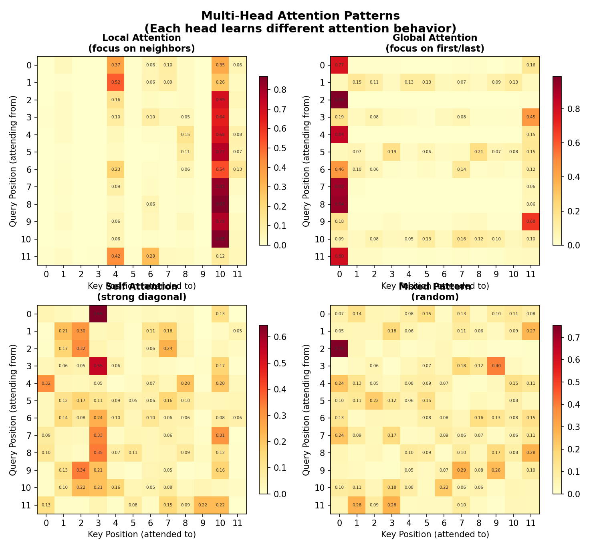

# Chapter 9: Large Language Models — Training, Sampling & Inference

> **Goal**: Understand how large language models (LLMs) are trained, how they generate text, and the techniques that make them practical.

> © xiefujin · Contact: 490021684@qq.com · Licensed under CC BY-NC-SA 4.0
>
> **Code**: `../code/ch09/` (4 files)

---

## 📋 Chapter Learning Objectives

- [ ] Understand the language modeling objective (next-token prediction)
- [ ] Master autoregressive generation
- [ ] Understand sampling strategies (greedy, top-k, top-p)
- [ ] Understand KV Cache for inference acceleration
- [ ] Master LoRA for efficient fine-tuning
- [ ] Understand quantization fundamentals

---

## 9-1 From Language Model to Large Language Model

#### 9-1-1 Basic Definition of Language Models

A language model assigns a probability to a sequence of tokens:

$$
P(w_1, w_2, \dots, w_n) = \prod_{t=1}^{n} P(w_t | w_{<t})
$$

### Scaling Hypothesis

As models get larger (more parameters, more data, more compute), capabilities **emerge**:

### Key LLMs

| Model | Parameters | Year | Innovation |
|:------|:-----------|:-----|:-----------|
| GPT-2 | 1.5B | 2019 | Zero-shot learning |
| GPT-3 | 175B | 2020 | In-context learning |
| LLaMA | 65B | 2023 | Open-source, efficient |
| GPT-4 | ~1.8T | 2023 | Multi-modal, reasoning |


*Figure 9-1: Scaling Laws — performance scales predictably with model size, data, and compute.*

---

## 9-2 Autoregressive Generation & Training

### Training Objective

Maximize the likelihood of the next token given previous tokens:

$$
L = -\sum_{t=1}^{T} \log P(w_t | w_{<t}; \theta)
$$

### Generation Loop

```python
def generate_autoregressive(model, prompt, max_tokens=100):
    """Autoregressive text generation"""
    tokens = tokenize(prompt)

    for _ in range(max_tokens):
        # Forward pass
        logits = model(tokens)

        # Get prediction for the next token
        next_token_logits = logits[:, -1, :]

        # Sample
        next_token = sample_from_logits(next_token_logits)

        # Append to sequence
        tokens = torch.cat([tokens, next_token], dim=1)

        # Stop if EOS token
        if next_token.item() == EOS_TOKEN_ID:
            break

    return detokenize(tokens)
```

---

## 9-3 Sampling Strategies ⭐

#### 9-3-1 Greedy Decoding

Always pick the most likely token:

$$w_t = \arg\max P(w | w_{<t})$$

✅ Simple, deterministic ❌ Repetitive, boring

#### 9-3-2 Temperature Control

Controls randomness:

$$P(w) \propto \exp(\text{logit}_w / T)$$

| Temperature | Effect |
|:------------|:-------|
| $T \to 0$ | Greedy (deterministic) |
| $T = 1$ | Standard softmax |
| $T > 1$ | More random, creative |

### Top-k Sampling

Only sample from the $k$ most likely tokens:

```python
def top_k_sampling(logits, k=50):
    """Sample from top-k tokens only"""
    values, indices = torch.topk(logits, k)
    probs = F.softmax(values / temperature, dim=-1)
    chosen = torch.multinomial(probs, 1)
    return indices[0, chosen]
```

### Top-p (Nucleus) Sampling

Sample from the smallest set of tokens whose cumulative probability exceeds $p$:

```python
def top_p_sampling(logits, p=0.9):
    """Nucleus sampling"""
    sorted_logits, sorted_indices = torch.sort(logits, descending=True)
    sorted_probs = F.softmax(sorted_logits / temperature, dim=-1)
    cumulative_probs = torch.cumsum(sorted_probs, dim=-1)

    # Remove tokens with cumulative probability above p
    sorted_indices_to_remove = cumulative_probs > p
    sorted_indices_to_remove[..., 1:] = sorted_indices_to_remove[..., :-1].clone()
    sorted_indices_to_remove[..., 0] = 0

    indices_to_remove = sorted_indices_to_remove.scatter(
        1, sorted_indices, sorted_indices_to_remove)
    logits[indices_to_remove] = float('-inf')
    probs = F.softmax(logits / temperature, dim=-1)
    return torch.multinomial(probs, 1)
```

#### 9-3-3 Sampling Strategy Comparison

| Strategy | Diversity | Quality | Use Case |
|:---------|:----------|:--------|:---------|
| Greedy | Low | High (first try) | Factual answers |
| Temperature | Medium | Medium | Creative writing |
| Top-k (k=50) | Medium | High | General purpose |
| Top-p (p=0.9) | High | High | Balanced |
| Top-k + Top-p | High | Highest | Production |

---

## 9-4 KV Cache: Inference Acceleration ⭐

### The Problem

At each generation step, the model re-computes attention for **all** previous tokens — $O(n^2)$ complexity.

### The Solution: KV Cache

Cache the Key and Value matrices from previous steps:

```python
class CachedAttention(nn.Module):
    def __init__(self, d_model, num_heads):
        super().__init__()
        self.num_heads = num_heads
        self.d_head = d_model // num_heads
        self.W_q = nn.Linear(d_model, d_model)
        self.W_k = nn.Linear(d_model, d_model)
        self.W_v = nn.Linear(d_model, d_model)

    def forward(self, x, kv_cache=None):
        batch, seq_len = x.shape[:2]

        Q = self.W_q(x).view(batch, seq_len, self.num_heads, self.d_head)
        K = self.W_k(x).view(batch, seq_len, self.num_heads, self.d_head)
        V = self.W_v(x).view(batch, seq_len, self.num_heads, self.d_head)

        # Concatenate with cache
        if kv_cache is not None:
            K_cache, V_cache = kv_cache
            K = torch.cat([K_cache, K], dim=1)
            V = torch.cat([V_cache, V], dim=1)

        # Update cache
        new_kv_cache = (K, V)

        # Attention (only need last query for generation)
        Q_last = Q[:, -1:] if kv_cache is not None else Q
        scores = torch.matmul(Q_last, K.transpose(-2, -1)) / (self.d_head ** 0.5)
        attn = F.softmax(scores, dim=-1)
        out = torch.matmul(attn, V)
        return out, new_kv_cache
```

### Speedup

| Without KV Cache | With KV Cache |
|:-----------------|:--------------|
| $O(n^2)$ per step | $O(n)$ per step |
| ~3× slower for 100 tokens | Baseline |
| ~10× slower for 1000 tokens | Baseline |

---

## 9-5 Efficient Fine-Tuning: LoRA

### The Problem

Full fine-tuning of a 175B model is **prohibitively expensive** ($> $1M per run).

### LoRA: Low-Rank Adaptation

LoRA freezes the original weights and adds **small rank decomposition matrices**:

$$
W' = W + BA
$$

Where $B \in \mathbb{R}^{d \times r}$, $A \in \mathbb{R}^{r \times k}$, and $r \ll \min(d, k)$.

```python
class LoRALayer(nn.Module):
    """Low-Rank Adaptation layer"""
    def __init__(self, original_layer, rank=8, alpha=16):
        super().__init__()
        self.original = original_layer
        self.original.requires_grad_(False)  # freeze

        d, k = original_layer.weight.shape
        self.A = nn.Parameter(torch.randn(rank, k) / rank)
        self.B = nn.Parameter(torch.zeros(d, rank))
        self.scale = alpha / rank

    def forward(self, x):
        # Original (frozen) + LoRA (trainable)
        return self.original(x) + (x @ self.A.T @ self.B.T) * self.scale
```

### Why LoRA Works

- Pre-trained models have **low intrinsic rank**
- A small number of parameters can capture task-specific adaptations
- Can swap LoRA modules for different tasks without loading the base model

### Memory Comparison

| Method | Trainable Params | Memory |
|:-------|:-----------------|:-------|
| Full fine-tune | 175B | > 350GB |
| LoRA (r=8) | ~0.3B | < 1GB |

---

## 9-6 Quantization Basics

### Why Quantize?

Reducing precision from FP32 → INT8:
- **4× smaller memory**
- **2-4× faster inference**
- Minimal accuracy loss

### Quantization Types

| Type | Description | Accuracy Loss |
|:-----|:------------|:--------------|
| **Post-training** (PTQ) | Quantize after training | Small |
| **Quantization-aware** (QAT) | Train with simulated quant | Minimal |
| **GPTQ** | Weight-only, one-shot | Very small |
| **GGML/GGUF** | CPU-optimized | Small |

### INT8 Quantization

```python
def quantize_int8(tensor):
    """Quantize FP32 tensor to INT8"""
    scale = tensor.abs().max() / 127.0
    quantized = (tensor / scale).round().char()
    return quantized, scale

def dequantize(quantized, scale):
    """Restore from INT8 to FP32"""
    return quantized.float() * scale
```

---

## 9-7 RLHF: Reinforcement Learning from Human Feedback

##### 9-7-1 RLHF (Reinforcement Learning from Human Feedback)

1. **SFT (Supervised Fine-Tuning)**: Fine-tune on human demonstrations
2. **RM (Reward Model)**: Train a model to predict human preference scores
3. **PPO (Reinforcement Learning)**: Optimize policy against the reward model with KL penalty

### Why RLHF?

- Language modeling objective ($P(w_t | w_{<t})$) ≠ helpful/honest/harmless
- Human feedback directly optimizes for what we want

---

## 9-8 RAG: Retrieval-Augmented Generation

### The Problem

LLMs have **knowledge cutoffs** and can **hallucinate** facts.

### Solution

RAG retrieves relevant documents from a knowledge base before generating:

1. **Query** → Embed into vector
2. **Retrieve** → Find top-K relevant documents from knowledge base
3. **Augment** → Combine instruction + retrieved docs + original query into prompt
4. **Generate** → LLM produces the final answer

### Benefits

| Benefit | Description |
|:--------|:------------|
| Up-to-date knowledge | No retraining needed |
| Verifiable | Can check source documents |
| Reduces hallucinations | Grounded in retrieved text |

---

## 9-9 Practical Model Quantization

```python
# Using bitsandbytes for quantization
import torch
import transformers

model = transformers.AutoModelForCausalLM.from_pretrained(
    "meta-llama/Llama-2-7b",
    load_in_4bit=True,  # 4-bit quantization
    bnb_4bit_compute_dtype=torch.float16,
)

# Memory: ~4GB instead of ~14GB for FP16
```

---

## 9-10 Prompt Engineering

### Key Techniques

| Technique | Description | Example |
|:----------|:------------|:--------|
| **Zero-shot** | No examples | "Translate to French: Hello" |
| **Few-shot** | A few examples | "English: Hello → French: Bonjour" |
| **Chain-of-thought** | Step-by-step reasoning | "Let's think step by step..." |
| **System prompt** | Role setting | "You are a helpful assistant" |

---

## 9-11 Evaluating LLMs

### Metrics

| Metric | What It Measures |
|:-------|:-----------------|
| **Perplexity** | How well the model predicts (lower is better) |
| **BLEU** | N-gram overlap with reference |
| **ROUGE** | Recall-oriented overlap |
| **Human eval** | Helpfulness, harmlessness |

---

## 📝 Supplementary Details

These subsections provide deeper mathematical background for the topics above.

#### 9-1-2 N-gram vs Neural Language Models

| Aspect | N-gram | Neural LM |
|:-------|:-------|:-----------|
| Context | Fixed window (n-1) | Variable (theoretically unlimited) |
| Sparsity | Severe for large n | No sparsity (distributed representations) |
| Generalization | Cannot handle unseen n-grams | Can generalize to unseen patterns |
| Parameters | $O(V^n)$ | $O(V \times d)$ (compact) |
| Performance | Saturates quickly | Improves with scale |

#### 9-1-3 Scaling Law ⭐

Scaling laws (Kaplan et al., 2020) show that Transformer performance follows power-law scaling with:
- **Model size** (parameters)
- **Dataset size** (tokens)
- **Compute** (FLOPs)

$$L(N, D) \approx \left(\frac{N_c}{N}\right)^{\alpha_N} + \left(\frac{D_c}{D}\right)^{\alpha_D}$$

Key insight: performance improves predictably with scale, with no signs of diminishing returns observed.

#### 9-2-1 Autoregressive Decomposition

An autoregressive (AR) model decomposes the joint probability into a product of conditional probabilities:

$$P(x_1, x_2, \dots, x_n) = \prod_{t=1}^{n} P(x_t | x_{<t})$$

This is the foundation of GPT-style models. At each step, the model predicts the next token given all previous tokens.

#### 9-2-2 Training vs Inference

**Training**: Teacher forcing — ground truth tokens are fed as input (even if the model predicts wrong tokens).

**Inference**: Autoregressive generation — the model's own predictions are fed back as input for the next step.

This discrepancy means errors accumulate during generation — a key challenge for LLMs.

#### 9-3-2 Top-K Sampling

At each step, sample only from the $K$ most likely tokens:

$$P'(x_t | x_{<t}) = \begin{cases} \frac{P(x_t)}{\sum_{i=1}^{K} P_{(i)}} & \text{if } \text{rank}(x_t) \leq K \\ 0 & \text{otherwise} \end{cases}$$

$K=40$ is a common choice. Top-K keeps generation focused but can be too restrictive.

#### 9-3-3 Top-P (Nucleus) Sampling

Sample from the smallest set of tokens whose cumulative probability exceeds threshold $p$:

$$\text{Select } V^{(p)} = \arg\min_{|V'|} \sum_{x \in V'} P(x | x_{<t}) \geq p$$

Unlike Top-K, the set size adapts dynamically. $p=0.9$ is a common choice.

#### 9-4-1 Pretraining

Pretraining is large-scale unsupervised learning on web text. The model learns:
- Language syntax and grammar
- World knowledge and facts
- Reasoning patterns

This stage is extremely compute-intensive (thousands of GPU-days).

#### 9-4-2 Fine-tuning

Fine-tuning adapts a pretrained model to a specific task:
- **Full fine-tune**: Update all parameters (expensive)
- **LoRA**: Low-rank adaptation (efficient, $\approx 0.1\%$ of params)
- **Adapter**: Small task-specific modules inserted into the model

LoRA has become the standard for efficient fine-tuning.

#### 9-8-1 Visualization: Multi-Head Attention Patterns 🆕

> **Key Insight**: Multi-head attention is like having multiple experts working in parallel — each head focuses on different aspects: local context (nearby tokens), global context (distant tokens), or self-attention (each token on itself).



*Figure 9-2: Multi-head attention patterns — X-axis is Key position (being attended to), Y-axis is Query position (attending from). Darker = higher attention weight. Different heads exhibit different patterns, demonstrating multi-head attention's multi-perspective capability.*

Run `code/ch09/NN09_attention_pattern_viz.py` to reproduce:

```bash
python3 code/ch09/NN09_attention_pattern_viz.py
```

| Head | Pattern | Characteristics |
|:-----|:--------|:----------------|
| Head 0 | **Local attention** | Focuses on nearby tokens, like CNN's local receptive field |
| Head 1 | **Global attention** | Focuses on sequence start/end (critical positions) |
| Head 2 | **Self-attention** | Strong diagonal — each token mainly attends to itself |
| Head 3 | **Mixed pattern** | No strong preference, flexibly combines information |

> **Core Insight**: The key advantage of multi-head attention is that different heads can **automatically learn** different attention patterns without manual design. Some heads capture local syntactic relationships; others capture global semantic relationships. This is why Transformer outperforms RNN: it captures both short and long-range dependencies in a single layer.

## 📦 Chapter Code List

| File | Content | Key Concept |
|:----|:-----|:----------|
| `ch09/NN09_training_loop.py` | Language model training loop | Training pipeline |
| `ch09/NN09_autoregressive.py` | Autoregressive generation implementation | Generation core |
| `ch09/NN09_attention_is_all_you_need.py` | Attention mechanism complete implementation | **Attention core** |
| `ch09/NN09_attention_pattern_viz.py` | Multi-head attention pattern visualization | Attention visualization |
| `ch09/NN09_scaling_law.py` | Scaling Law visualization | Scaling analysis |

---

## 📖 Chapter Summary

### LLM Technology Stack

1. **Pre-training**: Next-token prediction on massive corpus
2. **Fine-tuning**: SFT + RLHF for instruction following
3. **Inference**: Autoregressive generation with sampling strategies
4. **Optimization**: KV Cache (O(T²)→O(T)), quantization (FP32→INT4), LoRA

### 🧪 Exercises

#### Exercise 1: Implement Autoregressive Generation
Write a simple autoregressive generation loop with greedy decoding.

#### Exercise 2: Compare Sampling Strategies
Generate text with greedy, top-k (k=10), and top-p (p=0.9). Compare diversity.

#### Exercise 3: Implement LoRA
Add LoRA to a linear layer and verify only the LoRA parameters are trainable.

#### Exercise 4: KV Cache
Implement generation with and without KV cache. Measure the speedup.

← [Chapter 8](08-chapter8-modern-architectures.md) | [Table of Contents](README.md) | [Appendix A](appendix/A-mathematical-review.md) →
